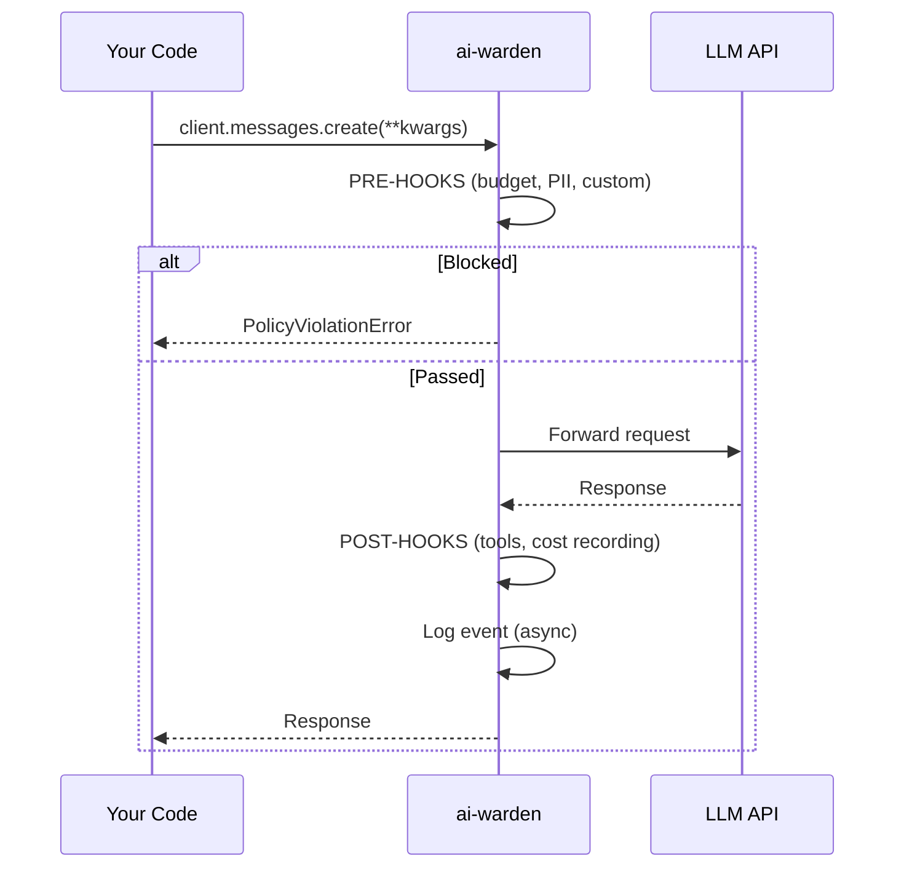
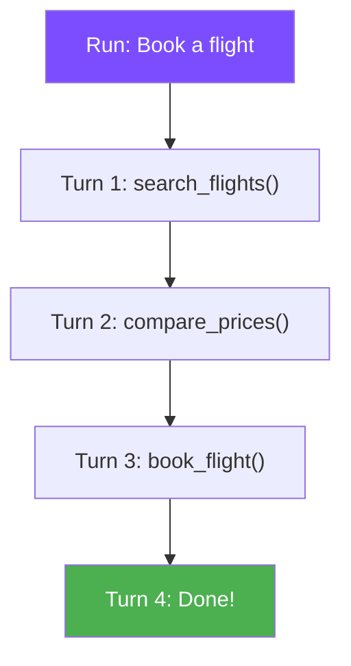

# :material-lightbulb: Core Concepts

ai-warden has four core concepts: **policies**, **agents**, **runs**, and **events**.

---

## :material-swap-horizontal: Interception model

ai-warden patches the Anthropic and OpenAI SDKs at the class level. Every instance of `Anthropic()` or `OpenAI()` created in your process is covered — no opt-in needed.



---

## :material-shield: Policies

A policy is a rule that governs what your agents can do. Policies have two phases:

| Phase | When | Can do |
|-------|------|--------|
| :material-arrow-right-bold: **pre** | Before the LLM call | Block the request, modify it, redact content |
| :material-arrow-left-bold: **post** | After the LLM responds | Intercept tool calls, record metrics, modify response |

### Verdicts

| Verdict | Icon | Effect |
|---------|------|--------|
| **Block** | :material-cancel: | Request rejected. `PolicyViolationError` raised. LLM never called. |
| **Warn** | :material-alert: | Logged in the event. Request/response passes through unchanged. |
| **Refusal** | :material-hand-back-right: | (post only) LLM response replaced with your message. Agent retries. |
| **Interrupt** | :material-stop-circle: | (post only) Exception raised. Agent loop breaks. |

### Priority and ordering

Policies run in priority order (lower number = runs first):


!!! tip "Short-circuit saves money"
    If budget blocks a request at priority 10, the expensive PII regex scan at priority 90 never runs. Cheap checks first.

---

## :material-account-group: Agents

An agent is a named identity for a group of LLM calls. Different agents can have different policies:

```yaml
policies:
  - name: chatbot-budget
    type: budget
    agents: ["chatbot"]      # only for chatbot
    limit: 10.00

  - name: pii-all
    type: pii                # no agents field = all agents
```

### Setting the agent name

=== ":material-code-parentheses: Context manager"

    ```python
    import aiwarden

    with aiwarden.agent("chatbot"):
        response = client.messages.create(...)
    ```

=== ":material-function: Per-call kwarg"

    ```python
    response = client.messages.create(
        model="claude-sonnet-4-6",
        messages=messages,
        _agent="chatbot",  # stripped before API call
    )
    ```

=== ":material-console: Environment variable"

    ```bash
    export AIWARDEN_AGENT_NAME=chatbot
    ```

!!! info "Priority order"
    `_agent` kwarg > `aiwarden.agent()` context manager > `AIWARDEN_AGENT_NAME` env var > `"default"`

---

## :material-run-fast: Runs

A run represents one complete agent task — start to finish, potentially many LLM calls:



Each run tracks:

- :material-identifier: `run_id` — unique identifier
- :material-counter: `turn` — call counter within the run
- :material-cash: `total_cost` — accumulated spend
- :material-clock-start: `start_time` — when the run began
- :material-tools: `tools_called` — list of tools used

### Automatic detection

ai-warden detects run boundaries automatically using deterministic signals:

1. :material-chart-timeline: **OpenTelemetry trace context** — a new `trace_id` means a new run
2. :material-tag: **Explicit `_run_id` kwarg** — your code passes a run identifier directly
3. :material-message-text: **Conversation structure** — first turn (no assistant messages) signals a new run

!!! note "These are deterministic, not heuristics"
    Each signal reliably identifies run boundaries. The `.create()` call's message history indicates whether this is a new conversation or a continuation.

### Explicit runs (Hot Mode)

For additional tracking (duration, parent-child topology, run summaries):

```python
import aiwarden

with aiwarden.run(agent="researcher") as r:
    response1 = client.messages.create(...)
    response2 = client.messages.create(...)

print(r.cost)    # $0.042
print(r.turns)   # 2
print(r.status)  # "completed"
```

Hot mode adds:

- :material-target: Explicit run boundaries (overrides automatic detection)
- :material-timer: Duration tracking
- :material-family-tree: Parent-child topology (nested runs)
- :material-file-document: Run summary events in the log

---

## :material-file-chart: Events

Every LLM call produces an event written to `~/.aiwarden/events.jsonl`:

```json
{
  "type": "llm_call",
  "timestamp": "2026-06-24T10:30:00Z",
  "provider": "anthropic",
  "model": "claude-sonnet-4-6",
  "prompt_tokens": 1200,
  "completion_tokens": 450,
  "cost": 0.0105,
  "latency_ms": 2340,
  "run_id": "abc123",
  "turn": 3,
  "agent": "chatbot",
  "caller": {"file": "app/chat.py", "line": 42},
  "policies": [
    {"name": "budget-cap", "action": "pass"},
    {"name": "pii-protection", "action": "warn"}
  ]
}
```

!!! tip "Zero latency impact"
    Events are written asynchronously by a background thread. Your LLM call latency is unaffected.

---

## :material-compare: Two modes of operation

| Mode | Setup | What you get |
|------|-------|-------------|
| :material-auto-fix: **Zero-touch** | `pip install ai-warden` + YAML | Auto-enforcement, per-call events, budget tracking, automatic run detection |
| :material-fire: **Hot Mode** | Add `aiwarden.run()` to your code | + explicit run boundaries, duration, parent-child topology, run summaries |

Most users start with zero-touch — run detection works automatically from OTel traces and conversation structure. Add hot mode when you need explicit run boundaries or parent-child agent topology.
