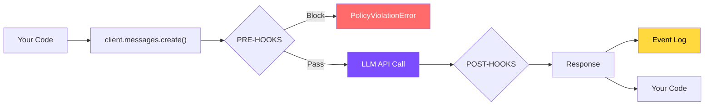

# :material-shield-lock: ai-warden

**Policy enforcement and observability for LLM agents. Zero code changes.**

<div class="grid cards" markdown>

-   :material-download:{ .lg .middle } **Install in seconds**

    ---

    One `pip install` and your agents are protected. No decorators, no wrappers, no configuration required.

    ```bash
    pip install ai-warden
    ```

-   :material-file-document-edit:{ .lg .middle } **Configure with YAML**

    ---

    Define policies in a simple YAML file. Budget limits, PII redaction, tool safety — all declarative.

    [:octicons-arrow-right-24: Configuration](configuration.md)

-   :material-eye:{ .lg .middle } **Observe everything**

    ---

    Every LLM call logged: cost, latency, tokens, policies fired. JSONL format, ready for any pipeline.

    [:octicons-arrow-right-24: Core Concepts](concepts.md)

-   :material-security:{ .lg .middle } **Five policy types**

    ---

    Budget control, PII redaction, tool safety, agent control, and custom rules. All out of the box.

    [:octicons-arrow-right-24: Built-in Policies](policies/overview.md)

</div>

---

## :material-rocket-launch: Quick start

### 1. Install

=== "pip"

    ```bash
    pip install ai-warden
    ```

=== "pip (with Redis)"

    ```bash
    pip install ai-warden[redis]
    ```

### 2. Create a policy file

Create `.aiwarden/policies.yaml` in your project root:

```yaml
policies:
  - name: pii-protection
    type: pii

  - name: budget-cap
    type: budget
    limit: 50.00
    reset: daily

  - name: tool-safety
    type: tools
    builtin:
      filesystem-safety: true
      no-privilege-escalation: true
      safe-git: true
```

### 3. Run your agent as normal

```python
import anthropic

client = anthropic.Anthropic()
response = client.messages.create(
    model="claude-sonnet-4-6",
    max_tokens=1024,
    messages=[{"role": "user", "content": "Hello!"}],
)
```

!!! success "That's it"
    ai-warden enforces automatically. If the agent tries to exceed its budget, the call is blocked before tokens are spent. If it tries to run `rm -rf /`, the response is replaced with a refusal message.

---

## :material-chart-timeline-variant: How it works



| Phase | What happens | Example |
|-------|-------------|---------|
| :material-arrow-right-bold: **Pre-hooks** | Check limits, redact PII, validate request | Budget exceeded? Block instantly. |
| :material-cloud: **LLM Call** | Only happens if pre-hooks pass | Zero cost if blocked. |
| :material-arrow-left-bold: **Post-hooks** | Intercept tool calls, record cost | Dangerous tool? Replace with refusal. |
| :material-file-chart: **Event Log** | Every call logged asynchronously | Cost, latency, policies fired. |

---

## :material-shield-check: What's included

| Policy | What it does | Default | 
|--------|-------------|---------|
| :material-eye-off: [**PII Protection**](policies/pii.md) | Redacts emails, SSNs, credit cards, API keys | :material-check: Enabled |
| :material-tools: [**Tool Safety**](policies/tools.md) | Blocks dangerous shell commands, file writes, force pushes | :material-check: Enabled |
| :material-cash: [**Budget Control**](policies/budget.md) | Spend limits per team/agent with daily/weekly/monthly reset | :material-close: Disabled |
| :material-robot: [**Agent Control**](policies/agent-control.md) | Limits turns, cost, duration per run. Loop detection. | :material-close: Disabled |
| :material-code-tags: [**Custom Rules**](policies/custom.md) | Declarative rules on any request/response field | :material-close: Disabled |

!!! note "Defaults apply only when no policy file exists"
    Once you create `.aiwarden/policies.yaml`, only the policies listed in it are active. See [Configuration](configuration.md#disabling-policies) for details on disabling defaults.

---

## :material-server-network: Distributed budget enforcement

For multi-process deployments (Kubernetes, Gunicorn workers), enable shared budget tracking via Redis:

```bash
pip install ai-warden[redis]
export AIWARDEN_REDIS_URL=redis://your-redis:6379
```

!!! tip "Zero config changes"
    Budget limits are now enforced across all pods atomically. Without Redis, budgets are tracked per-process. The env var is the only switch.

---

## :material-arrow-right-circle: Next steps

<div class="grid cards" markdown>

-   :material-lightbulb:{ .lg .middle } **Core Concepts**

    ---

    Understand policies, runs, agents, and how they connect.

    [:octicons-arrow-right-24: Read more](concepts.md)

-   :material-shield:{ .lg .middle } **Built-in Policies**

    ---

    All five policy types with parameters and examples.

    [:octicons-arrow-right-24: Overview](policies/overview.md)

-   :material-account-multiple:{ .lg .middle } **Multi-Agent**

    ---

    Different rules for different agents.

    [:octicons-arrow-right-24: Multi-Agent](multi-agent.md)

-   :material-code-braces:{ .lg .middle } **Examples**

    ---

    Copy-paste recipes for common setups.

    [:octicons-arrow-right-24: Single Agent](examples/single-agent.md)

</div>
