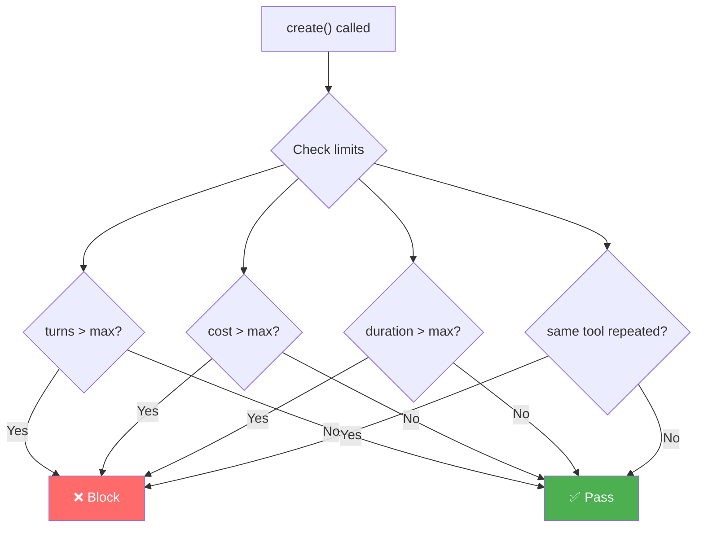

# :material-robot: Agent Control

**Type:** `agent_control` | **Priority:** 15 | **Hooks:** pre | **Default:** Disabled

Governs the run itself — how many turns, how much spend, how long, and whether the agent is stuck in a loop. Prevents runaway agents from consuming unlimited resources.

---

## :material-cog: How it works

Agent Control tracks state **per run** (not globally). Each time your agent starts a new task, the counters reset.



---

## :material-wrench: Configuration

```yaml
policies:
  - name: agent-limits
    type: agent_control
    agents: ["chatbot"]
    max_turns: 25
    max_cost: 5.00
    max_duration: 300
    max_tool_repeats: 3
```

---

## :material-table: Parameters reference

| Parameter | Type | Default | Description |
|-----------|------|---------|-------------|
| `max_turns` | integer | — | Max LLM calls per run |
| `max_cost` | float | — | Max dollar spend per run |
| `max_duration` | integer | — | Max run duration in seconds |
| `max_tool_repeats` | integer | — | Block when same tool called N times consecutively |
| `agents` | list | `[]` | Scope to specific agents |

!!! info "All parameters are optional"
    Only set the limits you care about. Unset limits are not enforced.

---

## :material-format-list-numbered: What each limit does

### :material-counter: `max_turns`

Counts LLM calls within a single run:

```
Turn 1: search_flights    ✅
Turn 2: compare_prices    ✅
...
Turn 25: final_response   ✅
Turn 26: another_call     ❌ BLOCKED
```

---

### :material-cash: `max_cost`

Tracks dollar cost accumulated within the current run:

```
Turn 1: $0.003  (total: $0.003)  ✅
Turn 2: $0.015  (total: $0.018)  ✅
...
Turn N: $0.12   (total: $5.01)   ❌ BLOCKED
```

---

### :material-timer: `max_duration`

Wall-clock time since the run started:

```
t=0s:   run starts
t=120s: turn 5   ✅ (120 < 300)
t=310s: turn 12  ❌ BLOCKED (310 > 300)
```

---

### :material-refresh: `max_tool_repeats`

Detects loops — same tool called consecutively:

```
search → search → search → search  ❌ BLOCKED (4 consecutive, limit=3)
search → calc → search → search    ✅ allowed (not consecutive)
```

!!! warning "Loop detection"
    Agents sometimes get stuck calling the same tool repeatedly with slight variations. This catches that pattern before it burns through your budget.

---

## :material-alert: Early warnings

At **80%** of any limit, a `warn` event is logged (request continues):

```
"Agent approaching turn limit: 20/25"
"Agent approaching cost limit: $4.10/$5.00"
```

---

## :material-compare: Difference from budget policy

| | :material-robot: `agent_control` | :material-cash: `budget` |
|---|---|---|
| **Scope** | One run (one task) | Across time (daily/monthly) |
| **Tracks** | Turns + cost + duration + loops | Cost only |
| **Resets** | Every new run | On time period boundary |
| **Use case** | "Agent shouldn't loop forever" | "Team shouldn't spend $500/month" |

!!! tip "Use both together"
    ```yaml
    # Per-run safety net
    - name: agent-limits
      type: agent_control
      max_turns: 50
      max_cost: 10.00

    # Monthly team budget
    - name: team-budget
      type: budget
      group_by: metadata.team
      limits:
        engineering: 500.00
      reset: monthly
    ```

---

## :material-code-braces: Examples

=== "Conservative chatbot"

    ```yaml
    - name: chatbot-limits
      type: agent_control
      agents: ["chatbot"]
      max_turns: 10
      max_cost: 1.00
      max_duration: 60
      max_tool_repeats: 2
    ```

=== "Long-running researcher"

    ```yaml
    - name: researcher-limits
      type: agent_control
      agents: ["researcher"]
      max_turns: 100
      max_cost: 20.00
      max_duration: 1800
      max_tool_repeats: 5
    ```

=== "Loop detection only"

    ```yaml
    - name: loop-detector
      type: agent_control
      max_tool_repeats: 3
    ```
