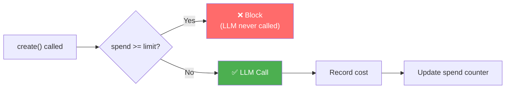

# :material-cash: Budget Control

**Type:** `budget` | **Priority:** 10 | **Hooks:** pre | **Default:** Disabled

Tracks LLM spend over time and blocks requests when a budget limit is exceeded. The LLM is never called when the budget is exhausted — zero tokens, zero cost, zero latency.

---

## :material-cog: How it works



1. :material-shield-check: **Every LLM call:** ai-warden automatically computes the dollar cost from the response's token counts and updates the spend counter. This happens at the system level — no policy configuration needed.
2. :material-cancel: **Pre-hook (enforcement):** Before each LLM call, checks accumulated spend against the limit. If `spend >= limit`, blocks the request.

!!! info "Cost tracking is not a policy concern"
    It's built into ai-warden's core. The budget policy only decides whether to block based on the accumulated total.

---

## :material-earth: Global limit

The simplest setup — a single dollar limit for all LLM calls:

```yaml
policies:
  - name: budget-cap
    type: budget
    limit: 100.00
    reset: daily
```

---

## :material-account-group: Per-group limits

Different spend limits for different teams, users, or any grouping:

```yaml
policies:
  - name: team-budgets
    type: budget
    group_by: metadata.team
    limits:
      engineering: 500.00
      research: 200.00
      intern: 20.00
      default: 50.00
    reset: monthly
```

**Pass the group in your LLM call:**

```python
response = client.messages.create(
    model="claude-sonnet-4-6",
    messages=messages,
    metadata={"team": "engineering"},  # (1)!
)
```

1.  The `metadata.team` value is resolved from the request dict. If the path doesn't resolve, the group defaults to `__global__`.

---

## :material-filter-variant: Conditional limits

Different limits based on arbitrary request fields:

```yaml
policies:
  - name: context-budgets
    type: budget
    limits:
      - when:
          metadata.environment: production
        limit: 1000.00
      - when:
          metadata.environment: staging
        limit: 100.00
      - default: 50.00
    reset: monthly
```

!!! tip "Conditions are evaluated in order"
    The first matching `when` clause wins.

---

## :material-table: Parameters reference

| Parameter | Type | Default | Description |
|-----------|------|---------|-------------|
| `limit` | float | — | Single dollar limit (mutually exclusive with `limits`) |
| `limits` | dict or list | — | Per-group or conditional limits |
| `group_by` | string | `""` | Dot-path to resolve group. Empty = global. |
| `reset` | string | `monthly` | Reset period: `daily`, `weekly`, or `monthly` |
| `agents` | list | `[]` | Scope to specific agents. Empty = all. |

---

## :material-clock-time-four: Reset periods

| Value | Resets at | Example key |
|-------|-----------|-------------|
| :material-calendar-today: `daily` | Midnight UTC | `2026-06-24` |
| :material-calendar-week: `weekly` | Monday 00:00 UTC | `2026-W25` |
| :material-calendar-month: `monthly` | 1st of month 00:00 UTC | `2026-06` |

---

## :material-server-network: Distributed enforcement (Redis)

!!! warning "Multi-process deployments"
    Without Redis, each process tracks spend independently. Pod A doesn't know what Pod B spent.

```bash
pip install ai-warden[redis]
export AIWARDEN_REDIS_URL=redis://your-redis:6379
```

With Redis enabled:

- [x] Atomic spend tracking via Lua scripts (`INCRBYFLOAT` + `EXPIRE`)
- [x] All pods share a single counter per group per period
- [x] Period-aware TTLs (daily=2d, weekly=8d, monthly=35d)
- [x] Graceful fallback if Redis goes down
- [x] No YAML config changes required

---

## :material-alert-circle: What happens when blocked

```python
from aiwarden.policies.base import PolicyViolationError

try:
    response = client.messages.create(...)
except PolicyViolationError as e:
    print(e.reason)
    # "Budget exceeded for 'engineering': $500.12 / $500.00 (monthly)"
```

!!! danger "The exception is raised BEFORE the LLM is called"
    Zero tokens consumed. Your application can catch it and handle gracefully.

---

## :material-code-braces: Examples

=== "Startup (tight budget)"

    ```yaml
    - name: startup-budget
      type: budget
      limit: 50.00
      reset: monthly
    ```

=== "Enterprise (team allocation)"

    ```yaml
    - name: enterprise-budgets
      type: budget
      group_by: metadata.department
      limits:
        engineering: 5000.00
        customer-support: 1000.00
        marketing: 500.00
        default: 100.00
      reset: monthly
    ```

=== "Per-agent daily"

    ```yaml
    - name: chatbot-daily
      type: budget
      agents: ["chatbot"]
      limit: 25.00
      reset: daily

    - name: batch-weekly
      type: budget
      agents: ["batch"]
      limit: 500.00
      reset: weekly
    ```
