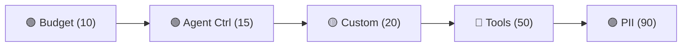

# :material-shield-check: Built-in Policies

ai-warden ships with five policy types. All configured via YAML — no code needed.

---

## :material-view-grid: Policy types

<div class="grid cards" markdown>

-   :material-cash:{ .lg .middle } **Budget Control**

    ---

    Spend limits per team/agent with daily/weekly/monthly reset. Blocks when exceeded.

    [:octicons-arrow-right-24: Budget](budget.md)

-   :material-robot:{ .lg .middle } **Agent Control**

    ---

    Per-run limits: max turns, cost, duration, and loop detection.

    [:octicons-arrow-right-24: Agent Control](agent-control.md)

-   :material-code-tags:{ .lg .middle } **Custom Rules**

    ---

    Declarative rules on any request/response field. Model restrictions, content filters.

    [:octicons-arrow-right-24: Custom](custom.md)

-   :material-tools:{ .lg .middle } **Tool Safety**

    ---

    Blocks dangerous tool calls: rm -rf, force-push, sudo, credential access.

    [:octicons-arrow-right-24: Tools](tools.md)

-   :material-eye-off:{ .lg .middle } **PII Protection**

    ---

    Redacts emails, SSNs, credit cards, API keys before the LLM sees them.

    [:octicons-arrow-right-24: PII](pii.md)

</div>

---

## :material-sort-numeric-ascending: Priority and execution order

Policies run in priority order (lower number = runs first):



| Priority | Policy | Rationale |
|----------|--------|-----------|
| 10 | :material-cash: Budget | Cheapest check — just compare two numbers |
| 15 | :material-robot: Agent Control | Check turn/cost/duration counters |
| 20 | :material-code-tags: Custom Rules | Your business logic |
| 50 | :material-tools: Tool Safety | Inspect response content (post-hook) |
| 90 | :material-eye-off: PII | Expensive regex scan — only if nothing blocked |

!!! success "Short-circuit saves money"
    If budget blocks at priority 10, PII redaction at priority 90 never runs. Expensive work is avoided entirely.

---

## :material-gesture-tap: Policy actions

| Action | Phase | Icon | Behavior |
|--------|-------|------|----------|
| **block** | pre | :material-cancel: | Request never reaches the LLM. `PolicyViolationError` raised. |
| **warn** | pre/post | :material-alert: | Logged in the event. Request/response passes through. |
| **refusal** | post | :material-hand-back-right: | Response replaced with your message. Agent retries gracefully. |
| **interrupt** | post | :material-stop-circle: | Exception raised. Agent loop breaks hard. |

!!! tip "When to use which"
    - **block** — budget exceeded, unauthorized model. LLM should never see this.
    - **warn** — approaching limits, unusual patterns. Log for review.
    - **refusal** — dangerous tool call. Give agent a helpful message to try differently.
    - **interrupt** — critical safety violation. Stop everything.

---

## :material-form-textbox: Common policy fields

Every policy type supports these fields:

```yaml
policies:
  - name: my-policy          # required — unique identifier
    type: budget             # required — pii, tools, budget, agent_control, custom, module
    enabled: true            # optional — disable without removing
    priority: 100            # optional — lower runs first
    agents: ["chatbot"]      # optional — scope to specific agents
    hooks: ["pre", "post"]   # optional — override which phases run
```

| Field | Type | Required | Description |
|-------|------|----------|-------------|
| `name` | string | :material-check: | Unique identifier. Used in logs and errors. |
| `type` | string | :material-check: | Policy type: `pii`, `tools`, `budget`, `agent_control`, `custom`, `module` |
| `enabled` | boolean | :material-close: | Default `true`. Set to `false` to disable. |
| `priority` | integer | :material-close: | Execution order. Lower = first. |
| `agents` | list | :material-close: | Scope to named agents. Empty = all. |
| `hooks` | list | :material-close: | Override phases: `["pre"]`, `["post"]`, `["pre", "post"]` |

---

## :material-account-filter: Agent scoping

The `agents` field restricts policies to specific named agents:

```yaml
policies:
  # Strict for chatbot
  - name: chatbot-budget
    type: budget
    agents: ["chatbot"]
    limit: 10.00
    reset: daily

  # Generous for researcher
  - name: researcher-budget
    type: budget
    agents: ["researcher"]
    limit: 200.00
    reset: monthly

  # Global PII (no agents field = everyone)
  - name: pii-global
    type: pii
```

=== ":material-code-parentheses: Context manager"

    ```python
    import aiwarden

    with aiwarden.agent("chatbot"):
        response = client.messages.create(...)
    ```

=== ":material-function: Per-call kwarg"

    ```python
    response = client.messages.create(
        ..., _agent="chatbot",
    )
    ```

=== ":material-console: Environment variable"

    ```bash
    export AIWARDEN_AGENT_NAME=chatbot
    ```

---

## :material-puzzle: Writing a module policy

For policies that need code beyond YAML:

```yaml
- name: my-complex-policy
  type: module
  module: mypackage.policies.RateLimitPolicy
  max_requests_per_minute: 60
```

[:octicons-arrow-right-24: Writing a Module Policy](../advanced/module-policy.md)
