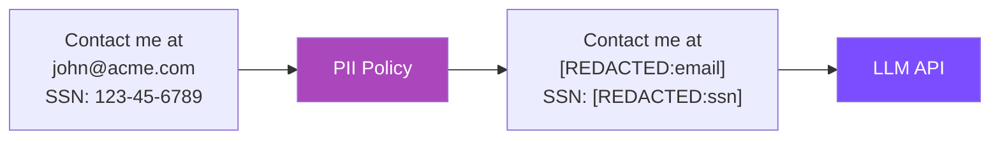

# :material-eye-off: PII Protection

**Type:** `pii` | **Priority:** 90 | **Hooks:** pre | **Default:** Enabled

Redacts personally identifiable information from the request before it reaches the LLM. The model never sees the real values — only `[REDACTED:type]` placeholders.

---

## :material-cog: How it works



1. Before the LLM call, PII Protection scans all message content
2. Matches are replaced with `[REDACTED:pattern_name]` tokens
3. The LLM receives sanitized input — it can reason about structure but never sees real data

---

## :material-check-all: Default patterns (zero config)

```yaml
policies:
  - name: pii-protection
    type: pii
```

| Pattern | What it matches | Example |
|---------|----------------|---------|
| :material-email: `email` | Email addresses | `user@example.com` → `[REDACTED:email]` |
| :material-phone: `phone` | Phone numbers (US/intl) | `+1-555-0123` → `[REDACTED:phone]` |
| :material-card-account-details: `ssn` | US Social Security Numbers | `123-45-6789` → `[REDACTED:ssn]` |
| :material-credit-card: `cc` | Credit card numbers | `4111-1111-1111-1111` → `[REDACTED:cc]` |
| :material-key: `api_key` | API key formats (`sk-...`) | `sk-abc123...` → `[REDACTED:api_key]` |

---

## :material-plus-circle: Adding custom patterns

```yaml
policies:
  - name: pii-protection
    type: pii
    patterns:
      employee_id: "\\bEMP-\\d{6}\\b"
      internal_ip: "\\b10\\.\\d+\\.\\d+\\.\\d+\\b"
      account_number: "\\bACCT-[A-Z0-9]{8}\\b"
      mrn: "\\bMRN-\\d{8}\\b"
```

!!! success "Custom patterns stack with builtins"
    Your patterns are added alongside the defaults. Each key becomes the redaction label:
    ```
    "Patient MRN-12345678 at 10.0.1.50"
    → "Patient [REDACTED:mrn] at [REDACTED:internal_ip]"
    ```

---

## :material-minus-circle: Disabling a built-in pattern

```yaml
policies:
  - name: pii-protection
    type: pii
    patterns:
      cc: false          # disable credit card detection
      phone: false       # disable phone number detection
```

!!! tip "Set to `false` to disable"
    Other built-in patterns remain active.

---

## :material-table: Parameters reference

| Parameter | Type | Default | Description |
|-----------|------|---------|-------------|
| `patterns` | dict | `{}` | Custom patterns (string = regex) or disabled builtins (`false`) |
| `agents` | list | `[]` | Scope to specific agents. Empty = all. |

---

## :material-magnify: What gets scanned

- [x] User messages (string and content-block formats)
- [x] System prompt content
- [x] All `text` type content blocks
- [ ] Tool results (outputs, not inputs)
- [ ] Image content blocks
- [ ] Non-content fields (model, max_tokens)

---

## :material-speedometer: Performance

- :material-flash: Patterns compiled once at startup
- :material-timer: Typical overhead: < 1ms for messages under 10KB
- :material-scale-balance: Proportional to message length x number of patterns

!!! tip "For high-throughput batch scenarios"
    Disable patterns you don't need to reduce scan time.

---

## :material-code-braces: Examples

=== "Healthcare (HIPAA)"

    ```yaml
    - name: hipaa-pii
      type: pii
      patterns:
        mrn: "\\bMRN[-:]?\\d{6,10}\\b"
        dob: "\\b\\d{2}/\\d{2}/\\d{4}\\b"
        npi: "\\b\\d{10}\\b"
    ```

=== "Financial"

    ```yaml
    - name: financial-pii
      type: pii
      patterns:
        routing_number: "\\b\\d{9}\\b"
        swift_code: "\\b[A-Z]{6}[A-Z0-9]{2}([A-Z0-9]{3})?\\b"
        iban: "\\b[A-Z]{2}\\d{2}[A-Z0-9]{4,30}\\b"
    ```

=== "Agent-specific"

    ```yaml
    - name: pii-chatbot-only
      type: pii
      agents: ["chatbot", "support-bot"]
      patterns:
        employee_id: "\\bEMP-\\d{6}\\b"
    ```
