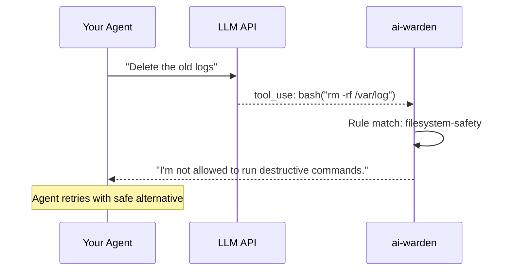

# :material-tools: Tool Safety

**Type:** `tools` | **Priority:** 50 | **Hooks:** post | **Default:** Enabled

Inspects LLM responses for dangerous tool calls and blocks them before your agent executes them. The agent sees a refusal message and can try a different approach.

---

## :material-cog: How it works



!!! info "Post-hook only"
    Tool Safety runs after the LLM responds because it inspects what tool the model wants to call. The LLM call already happened (tokens consumed), but the dangerous action is prevented.

---

## :material-shield-star: Built-in templates

Enable pre-built rule sets with a single flag:

```yaml
policies:
  - name: tool-safety
    type: tools
    builtin:
      filesystem-safety: true
      no-privilege-escalation: true
      safe-git: true
      no-credential-access: true
      no-auto-install: true
      network-safety: true
```

| Template | Icon | What it blocks |
|----------|------|----------------|
| `filesystem-safety` | :material-folder-lock: | `rm -rf`, `rm -fr`, writes to `/etc/`, `/sys/`, `/proc/` |
| `no-privilege-escalation` | :material-shield-alert: | `sudo`, `su`, `chmod 777`, `chown root` |
| `safe-git` | :material-source-branch: | `git push --force`, `git reset --hard`, `git clean -f` |
| `no-credential-access` | :material-key-remove: | Reading `.env`, `.ssh/`, `.aws/credentials` |
| `no-auto-install` | :material-package-down: | `pip install`, `npm install`, `apt-get install` |
| `network-safety` | :material-web-off: | Warns on `curl`, `wget`, `nc` (warn, not block) |

!!! tip "Templates stack"
    Enable as many as you need. Custom rules work alongside templates.

---

## :material-pencil-ruler: Custom rules

```yaml
policies:
  - name: tool-safety
    type: tools
    rules:
      - name: no-prod-db-writes
        action: refusal
        message: "Database writes blocked in production."
        match:
          tool: execute_sql
          query:
            regex: "(?i)(INSERT|UPDATE|DELETE|DROP)"
        when:
          metadata:
            environment: production
```

---

## :material-table: Rule fields

| Field | Type | Required | Description |
|-------|------|----------|-------------|
| `name` | string | :material-check: | Rule identifier. Appears in logs. |
| `action` | string | :material-check: | `refusal`, `interrupt`, or `warn` |
| `message` | string | :material-close: | Message shown to the agent |
| `match` | dict | :material-check: | Matching criteria |
| `when` | dict | :material-close: | Context conditions |

---

## :material-gesture-tap: Actions

| Action | Icon | Agent loop | Use case |
|--------|------|------------|----------|
| `refusal` | :material-hand-back-right: | Continues | Agent gets feedback, tries differently |
| `interrupt` | :material-stop-circle: | Breaks | Critical violation, stop entirely |
| `warn` | :material-alert: | Continues | Log for review, don't disrupt |

---

## :material-magnify: Match syntax

### Tool name

=== "Exact"

    ```yaml
    match:
      tool: bash
    ```

=== "Glob"

    ```yaml
    match:
      tool: "*write*"
    ```

=== "List"

    ```yaml
    match:
      tool: ["bash", "shell", "run_command"]
    ```

=== "Wildcard"

    ```yaml
    match:
      tool: "*"
    ```

### Argument operators

| Operator | Example | Matches |
|----------|---------|---------|
| `contains` | `{contains: "rm -rf"}` | Substring match |
| `startswith` | `{startswith: ["/etc/", "/sys/"]}` | Prefix match (list = any) |
| `not_startswith` | `{not_startswith: ["/tmp/"]}` | NOT prefix |
| `equals` | `{equals: "production"}` | Exact match |
| `in` | `{in: ["prod", "staging"]}` | Value in list |
| `regex` | `{regex: "rm\\s+-[rRfF]*[rR]"}` | Python regex |

### Any-argument matching

Match if **any** argument contains the pattern:

```yaml
match:
  tool: "*"
  any_arg:
    contains: "password"
```

### Context scoping

```yaml
match:
  tool: execute_sql
  query:
    regex: "(?i)DROP"
when:
  metadata:
    deployment: production
```

!!! note "Without `when`, rules apply globally"
    Add `when` to restrict to specific environments/contexts.

---

## :material-code-braces: Examples

=== "Block destructive SQL"

    ```yaml
    rules:
      - name: no-drop-in-prod
        action: interrupt
        message: "DROP TABLE blocked. Use a migration."
        match:
          tool: execute_sql
          query:
            regex: "(?i)DROP\\s+(TABLE|DATABASE)"
        when:
          metadata:
            environment: production
    ```

=== "Restrict file writes"

    ```yaml
    rules:
      - name: project-only-writes
        action: refusal
        message: "Writes restricted to project directory."
        match:
          tool: ["write_file", "create_file"]
          path:
            not_startswith: ["/home/deploy/myproject/", "/tmp/"]
    ```

=== "Warn on network access"

    ```yaml
    rules:
      - name: log-network
        action: warn
        match:
          tool: bash
          command:
            regex: "(curl|wget|nc)\\s"
    ```
